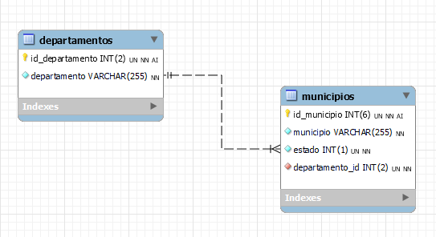

### 🇨🇴 Base de Datos de Departamentos y Municipios de Colombia 📚

===========================================================

- 📈 Versión: 1.0
- 🔗 Compatibilidad: MySQL 5.7+, MariaDB 10.2+
- 📆 Última Actualización: [6/11/2024] 📆
- 👨‍💻 Autor: [sanchezluys] 👋

### 📄 Descripción

🗺️ Esta base de datos contiene información detallada de los departamentos y municipios de Colombia. Está diseñada para ser utilizada en aplicaciones web, móviles y de escritorio que requieran datos geográficos precisos del país. 📊

### 🗂️ Estructura de la Base de Datos



#### 📁 Tablas

##### 1. 🏛️ departamentos

| Campo         | Tipo de Datos | Descripción                   |
|---------------|---------------|-------------------------------|
| `id_departamento` | `int`       | ID único del departamento    |
| `departamento`       | `varchar(255)` | Nombre del departamento       |

###### 2. 🏙️ municipios

| Campo         | Tipo de Datos | Descripción                   |
|---------------|---------------|-------------------------------|
| `id_municipio` | `int`       | ID único del municipio        |
| `municipio`       | `varchar(255)`| Nombre del municipio          |
| `estado`       | `int`| Estado, 1:activo          |
| `departamento_id`| `int`       | ID del departamento al que pertenece |

##### 3. 🔗 Relaciones
- Un departamento puede tener múltiples municipios (One-To-Many): departamentos.id_departamento = municipios.id_departamento 👫

### 📦 Archivos Incluidos

- colombia_departamentos_municipios.sql: Archivo SQL de creación de la base de datos y carga de datos. 📄
- README.md: Este archivo de descripción. 📖

### 🚀 Instrucciones de Instalación

#### 🔨 Crear la Base de Datos:

- Abrir tu cliente MySQL o MariaDB (e.g., phpMyAdmin, MySQL Workbench).
- Crear una nueva base de datos (e.g., colombia_geografico).
- Seleccionar la base de datos recién creada. 📁

#### 📥 Importar el Archivo SQL:

- En tu cliente, encontrar la opción para importar un archivo SQL.
- Seleccionar el archivo colombia_departamentos_municipios.sql proporcionado.
- Ejecutar la importación. 🔄

### 🔍 Uso de la Base de Datos

#### 📊 Ejemplo de Consulta

Obtener todos los municipios de un departamento específico (por ejemplo, Antioquia):

```sql
SELECT m.nombre AS municipio
FROM municipios m
JOIN departamentos d ON m.id_departamento = d.id_departamento
WHERE d.nombre = 'Antioquia';
```	

😊 ¡Disfruta explorando la base de datos! 🎉
